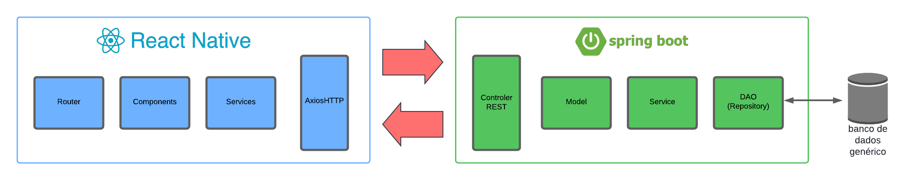
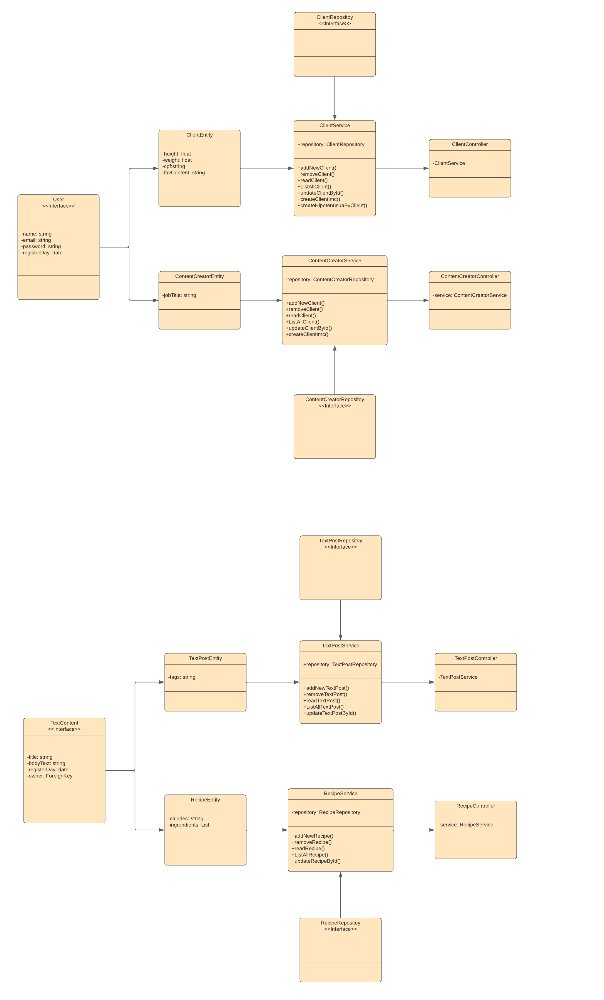
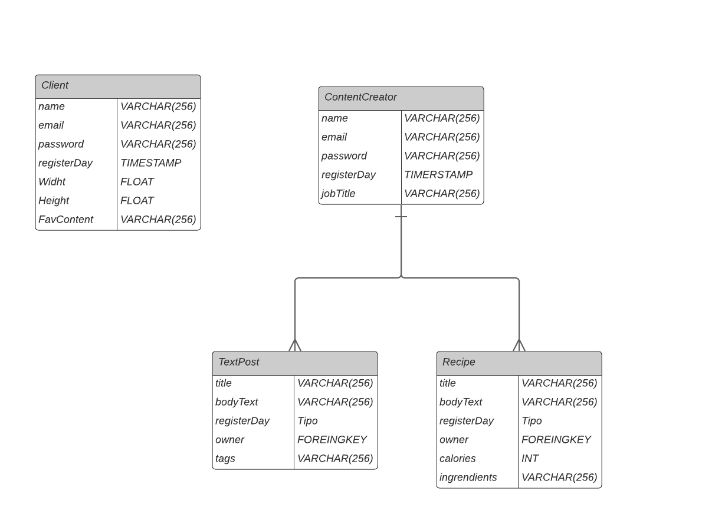
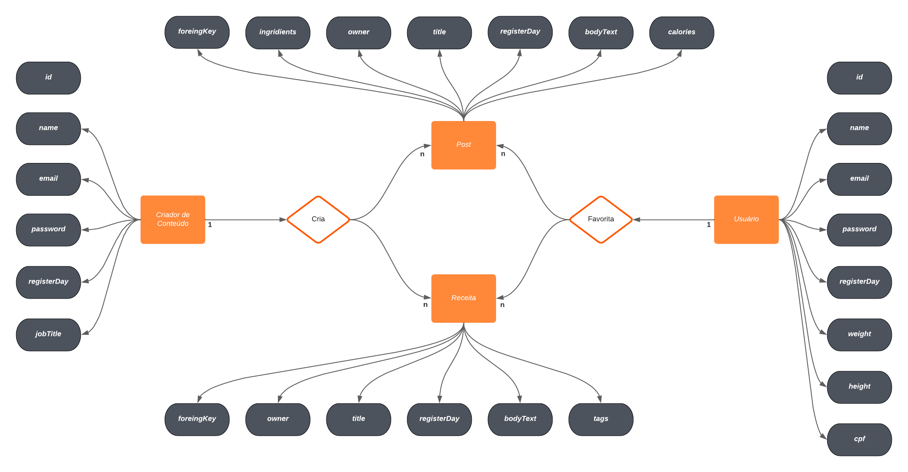

# Arquitetura da Solução


Conforme segue o diagrama, teremos dois serviços, uma aplicação java feita em SPRINGBOOT e um aplicação REACT montanda em java, que se comunicam através de uma API REST



## Diagrama de Classes



## Modelo ER



## Esquema Relacional




## Modelo Físico

### Tabela usuários
```
CREATE TABLE usuarios (
    id UUID PRIMARY KEY,
    name VARCHAR(255) NOT NULL,
    email VARCHAR(255) NOT NULL UNIQUE,
    password VARCHAR(255) NOT NULL,
    registerDay DATE NOT NULL,
    height FLOAT,
    weight FLOAT,
    cpf VARCHAR(14) UNIQUE
);
```

Insere dados
```
INSERT INTO usuarios (id, name, email, password, registerDay, height, weight, cpf)
VALUES ('123e4567-e89b-12d3-a456-426614174000', 'Maria Silva', 'maria@example.com', 'senhaSegura123', '2024-04-21', 165.5, 54.3, '111.222.333-44');
```

Atualiza dados

```
UPDATE usuarios
SET email = 'novo.email@maria.com', password = 'novaSenha456'
WHERE id = '123e4567-e89b-12d3-a456-426614174000';
```
Apaga dados
```
DELETE FROM usuarios
WHERE id = '123e4567-e89b-12d3-a456-426614174000';
```

### Tabela de criadores de conteúdo
```
CREATE TABLE employees (
    id UUID PRIMARY KEY,
    name VARCHAR(255) NOT NULL,
    email VARCHAR(255) NOT NULL UNIQUE,
    password VARCHAR(255) NOT NULL,
    registerDay DATE NOT NULL,
    jobTitle VARCHAR(255) NOT NULL
);
```
Insere dados
```
INSERT INTO employees (id, name, email, password, registerDay, jobTitle)
VALUES ('c1a2b3c4-d5e6-f7g8-h9i0-j1k2l3m4n5o6', 'Ana Souza', 'ana.souza@example.com', 'senha123', '2024-04-21', 'Desenvolvedora de Software');
```
Atualiza dados
```
UPDATE employees
SET jobTitle = 'Gerente de Projeto', password = 'novaSenha456'
WHERE id = 'c1a2b3c4-d5e6-f7g8-h9i0-j1k2l3m4n5o6';
```

Apaga dados
```
DELETE FROM employees
WHERE id = 'c1a2b3c4-d5e6-f7g8-h9i0-j1k2l3m4n5o6';
```

### Tabela de receitas
```
CREATE TABLE recipes (
    id UUID PRIMARY KEY,
    title VARCHAR(255) NOT NULL,
    bodyText TEXT NOT NULL,
    registerDay DATE NOT NULL,
    calories VARCHAR(255),
    creator_id UUID,
    ingredients TEXT,
    FOREIGN KEY (creator_id) REFERENCES content_creators(creator_id)
);
);
```
Insere dados
```
-- Inserir uma receita
INSERT INTO recipes (id, title, bodyText, registerDay, calories, creator_id, ingredients)
VALUES ('uuid-recipe-1', 'Deliciosa Lasanha', 'Passo a passo para fazer uma lasanha...', '2024-04-21', '500', 'uuid-creator-1', 'Molho de Tomate, Massa de Lasanha, Queijo');

```

Atualiza dados
```
UPDATE recipes
SET title = 'Lasanha de Queijo', bodyText = 'Descubra como fazer uma lasanha de queijo...', ingredients = 'Molho de Tomate, Massa de Lasanha, Queijo, Ricota'
WHERE id = 'uuid-recipe-1';
```

Apaga dados
```
DELETE FROM recipes
WHERE id = 'uuid-recipe-1';
```

### Tabela de posts
```
CREATE TABLE articles (
    id UUID PRIMARY KEY,
    title VARCHAR(255) NOT NULL,
    bodyText TEXT NOT NULL,
    registerDay DATE NOT NULL,
    tags TEXT,
    creator_id UUID,
    FOREIGN KEY (creator_id) REFERENCES content_creators(creator_id)
);
```

Insere dados
```
INSERT INTO articles (id, title, bodyText, registerDay, tags, creator_id)
VALUES ('uuid-article-1', 'Título do Artigo', 'Texto do Corpo do Artigo', '2024-04-21', 'tag1, tag2', 'uuid-creator-1');
Atualização de Dados (UPDATE)
```

Atualiza dados
```
UPDATE articles
SET title = 'Novo Título', bodyText = 'Novo Texto do Corpo', tags = 'novaTag1, novaTag2'
WHERE id = 'uuid-article-1';

```

Apaga dados
```
DELETE FROM articles
WHERE id = 'uuid-article-1';
```

## Bancos usados


## Tecnologias Utilizadas

- SpringBoot
- REACT
- Railway
- Postgres
- RESTFUL
## Hospedagem

A API de consumo da aplicação se encontra na fonte https://api-fit-61np.onrender.com/api/v1/

## Qualidade de Software

A norma internacional ISO/IEC 25010, que é uma atualização da ISO/IEC 9126, define oito características e trinta subcaracterísticas de qualidade para produtos de software. A seguir, é apresentada uma tabela com as características e subcaracterísticas importantes para o desenvolvimento de um aplicativo que visa fornecer fácil acesso à informações nutricionais de qualidade:

| Característica | Subcaracterística | Justificativa |
|----------------|-------------------|---------------|
| Usabilidade    | - Inteligibilidade<br> - Apreensibilidade <br> - Operacionalidade | - Facilidade com que o usuário pode compreender as funcionalidades  do sistema e avaliar se o mesmo pode ser usado para satisfazer as suas necessidades. <br> - Identifica a facilidade de aprendizado do sistema para os seus potenciais usuários. <br> - O sistema possui atributos que facilitam seu uso e controle.<br>|
| Segurança | - Confidencialidade | - O sistema é capaz de garantir que dados são acessados apenas por aqueles que têm acesso autorizado. |
| Manutenibilidade | - Modularidade <br> - Modificabilidade<br> - Testabilidade<br>| - Mecanismo que permite que um sistema de software seja dividido em partes que interagem entre si.<br> - Capacidade de um produto ou sistema ser modificado sem introduzir defeitos ou diminuir a qualidade atual.<br> - Efetividade de testes para o sistema.|
| Portabilidade | - Facilidade de instalação | - Capacidade de um produto ou sistema ser instalado ou desinstalado facilmente.|
| Eficiência |- Comportamento em relação ao tempo. | - Tempo de resposta e processamento. |

A partir das características e subcaracterísticas apresentadas, é possível estabelecer métricas de avaliação do produto, que são utilizadas para caracterizar e ter melhor entendimento de todo o processo por trás do produto desenvolvido:

| Subcaracterísticas | Métricas | Escala | Peso |
|--------------------------|-------------|-----------|--------|
| Inteligibilidade | É fácil compreender o sistema? | 1. Atende completamente <br> 2. Atende parcialmente <br> 3. Não atende |ALTO|
| Apreensibilidade | É fácil aprender a usar? | 1. Atende completamente <br> 2. Atende parcialmente <br> 3. Não atende |ALTO|
| Operacionalidade | É fácil fazer operações no sistema? | 1. Atende completamente <br> 2. Atende parcialmente <br> 3. Não atende |ALTO|
| Confidencialidade | O sistema possui validação de acesso? | 1. Sim<br> 2. Não | ALTO |
| Modularidade | Há interação entre os módulos do sistema? | 1. Sim <br> 2. Não |ALTO|
| Modificabilidade | É viável implementar modificações? | 1. Sim <br> 2. Não |ALTO|
| Testabilidade | Os testes de software e de usabilidade são de fácil elaboração e entendimento? | 1. Fácil<br> 2. Médio<br> 3. Difícil<br> |ALTO|
| Facilidade de instalação | É fácil instalar e desinstalar o aplicativo de um aparelho móvel? | 1. Fácil<br> 2. Médio<br> 3. Difícil<br> |ALTO|
| Modificabilidade | É viável implementar modificações? |  1. Sim<br> 2. Não | ALTO |
| Testabilidade | Os testes de software e de usabilidade são de fácil elaboração e entendimento? | 1. Fácil<br> 2. Médio<br> 3. Difícil<br> |ALTO|
| Facilidade de instalação | É fácil instalar e desinstalar o aplicativo de um aparelho móvel? | 1. Fácil<br> 2. Médio<br> 3. Difícil<br> |ALTO|
| Comportamento em relação ao tempo | O tempo de resposta e de processamento é satisfatório?| 1. Satisfatório<br> 2. Insatisfatório | ALTO | 

